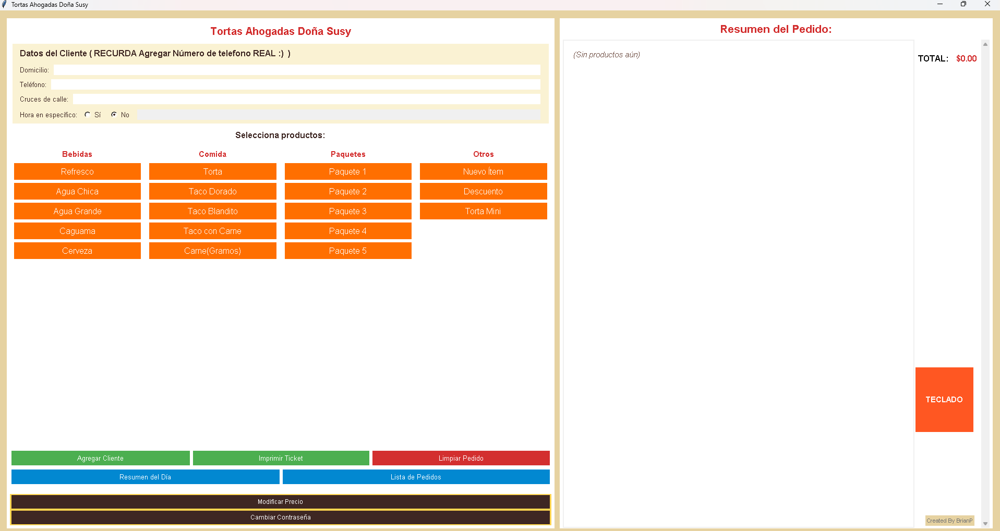
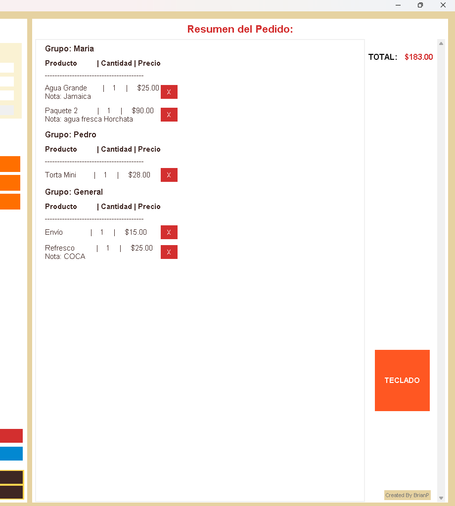
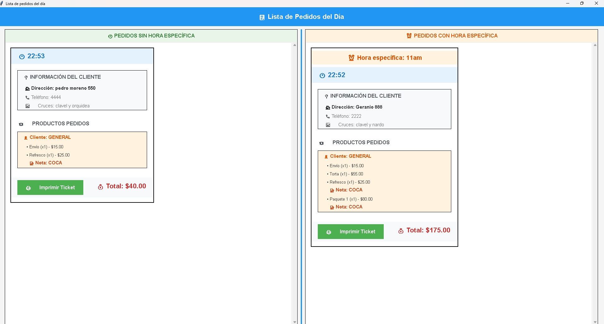

# 🌮 Tortas Ahogadas Doña Susy - Sistema de Pedidos

<div align="center">


*Sistema completo de gestión de pedidos para un Restaurante de Tortas Ahogadas*

</div>

---

## 📋 Descripción General

**Tortas Ahogadas Doña Susy** es un sistema de gestión de pedidos diseñado específicamente para negocios de comida mexicana. Desarrollado en Python con una interfaz gráfica intuitiva, permite gestionar pedidos a domicilio de manera eficiente y profesional.

### ✨ ¿Por qué elegir este sistema?

- 🚀 **Fácil de usar**: Interfaz intuitiva diseñada para usuarios no técnicos
- 💾 **Gestión automática**: Autocompletado de datos de clientes frecuentes
- 🖨️ **Impresión profesional**: Tickets personalizados listos para entregar
- 📊 **Reportes completos**: Resúmenes diarios y control de ventas
- 🎯 **Especializado**: Diseñado específicamente para comida mexicana

---

## 🎯 Características Principales

### 🛒 **Gestión de Pedidos**
- Registro rápido de productos (tortas, tacos, bebidas, paquetes)
- Sistema de anotaciones personalizadas ("sin verdura", "extra salsa", etc.)
- Selección de sabores para aguas frescas (Jamaica, Horchata)

### 👥 **Gestión de Clientes**
- **Base de datos automática** con SQLite
- **Autocompletado inteligente**: Al ingresar un número de teléfono, el sistema autocompleta automáticamente la dirección y cruces si el cliente ya está registrado
- **Registro automático**: Si es un cliente nuevo, al imprimir el ticket se guarda automáticamente en la base de datos para futuros pedidos
- Organización por grupos de clientes

### 🖨️ **Sistema de Impresión**
- Tickets profesionales con todos los detalles
- Formato optimizado para impresoras térmicas
- Impresión automática tras completar pedido

### 📊 **Reportes y Análisis**
- Resumen completo del día con totales
- Lista detallada de todos los pedidos
- Opción de impresión para reportes

### 🔒 **Seguridad**
- Sistema de contraseñas para funciones administrativas
- Protección de datos de clientes y reportes

---

## 🛠️ Instalación y Configuración

### 📋 Requisitos del Sistema

| Componente | Versión | Estado |
|------------|---------|--------|
| **Python** | 3.6+ | ✅ Requerido |
| **Sistema Operativo** | Windows | ✅ Requerido |
| **Impresora** | Cualquiera configurada | ⚠️ Recomendado |

### 📦 Instalación de Dependencias

```bash
# Instalar dependencia para impresión (Windows)
pip install pywin32
```

> **📝 Nota**: `tkinter` y `sqlite3` vienen preinstalados con Python

### 🚀 Instalación Rápida

1. **Descarga el código**
   ```bash
   git clone [tu-repositorio]
   cd tortas-ahogadas-sistema
   ```

2. **Ejecuta el programa**
   ```bash
   python main.py
   ```

3. **¡Listo!** El sistema creará automáticamente la base de datos al primer uso

---

## 📖 Guía de Uso

### 1️⃣ **Registro de Cliente**

<div align="center">

| Paso | Acción | Resultado |
|------|--------|-----------|
| 📞 | Ingresa número de teléfono | Si existe: Autocompleta dirección y cruces automáticamente |
| 🏠 | Completa datos faltantes | Si es cliente nuevo: Llena manualmente dirección y cruces |
| 💾 | Al imprimir ticket | El nuevo cliente se guarda automáticamente en la base de datos |
| ✅ | Cliente listo | Procede a tomar el pedido |

</div>

### 2️⃣ **Toma de Pedido**

```
🍴 Comida → Selecciona tortas, tacos, etc.
🥤 Bebidas → Elige refrescos o aguas frescas
📦 Paquetes → Combos especiales
📝 Anotaciones → Personaliza cada producto
```

### 3️⃣ **Finalización**

- ✅ Revisa el resumen del pedido
- 🖨️ Presiona "Imprimir Ticket"
- 📋 Entrega el ticket al cliente

---

## 🖼️ Capturas de Pantalla

### Interfaz Principal

*Vista principal del sistema con todas las opciones disponibles*

### Selección de Sabores

*Ventana emergente para seleccionar sabor de agua fresca*

### Gestión por Grupos

*Sistema de grupos para organizar pedidos múltiples*

### Reportes del Día
<div align="center">

| Resumen Diario | Lista de Pedidos |
|----------------|------------------|
|  |  |

</div>

---

## ⚙️ Configuración Avanzada

### 🔑 **Gestión de Contraseñas**
- Contraseña predeterminada: `123`
- Cambiar desde el botón "Cambiar Contraseña"
- Protege funciones administrativas

### 💾 **Base de Datos Inteligente**

El sistema cuenta con una funcionalidad avanzada de gestión de clientes:

#### 🔍 **Búsqueda Automática**
1. **Ingresas el teléfono** → El sistema busca automáticamente en la base de datos
2. **Cliente existente** → Se autocompletان campos de dirección y cruces
3. **Cliente nuevo** → Los campos permanecen vacíos para llenar manualmente

#### 💾 **Guardado Automático**
- Al **imprimir el ticket**, si es un cliente nuevo, sus datos se guardan automáticamente
- En **próximos pedidos**, solo necesitas el teléfono para recuperar toda la información
- **No hay pasos extra**: El sistema gestiona todo transparentemente

#### 📊 **Ventajas del Sistema**
- ⚡ **Rapidez**: Clientes frecuentes = pedidos más rápidos
- 🎯 **Precisión**: Evita errores en direcciones repetidas  
- 📈 **Crecimiento**: Tu base de clientes crece automáticamente

### 💾 **Configuración de Base de Datos**
- **Archivo**: `clientes.db` (creado automáticamente)
- **Ubicación**: Mismo directorio del programa
- **Respaldo**: Recomendado hacer copias periódicas
- Usa la impresora predeterminada del sistema
- Compatible con impresoras térmicas
- Formato optimizado para tickets de 80mm

---

## 🚨 Solución de Problemas

### ❓ Problemas Comunes

<details>
<summary><strong>🖨️ La impresora no funciona</strong></summary>

**Posibles soluciones:**
- Verifica que la impresora esté configurada como predeterminada
- Asegúrate de que `pywin32` esté instalado correctamente
- Reinicia el programa después de configurar la impresora

</details>

<details>
<summary><strong>💾 Error en la base de datos</strong></summary>

**Posibles soluciones:**
- Verifica permisos de escritura en el directorio
- Elimina `clientes.db` para recrear la base de datos
- Ejecuta como administrador si es necesario

</details>

<details>
<summary><strong>🐍 Error al ejecutar Python</strong></summary>

**Posibles soluciones:**
- Verifica que Python 3.6+ esté instalado
- Asegúrate de que Python esté en el PATH del sistema
- Reinstala las dependencias: `pip install pywin32`

</details>

---

## 🔮 Próximas Características

- [ ] 🌐 Versión web para acceso remoto
- [ ] 📱 App móvil para pedidos
- [ ] 🔄 Sincronización en la nube

---

## 🤝 Contribuir

¿Te gustaría contribuir al proyecto? ¡Será genial tenerte a bordo!

### 🎯 Formas de Contribuir

- 🐛 **Reportar bugs**: Abre un issue describiendo el problema
- 💡 **Sugerir mejoras**: Comparte tus ideas para nuevas características  
- 🔧 **Contribuir código**: Fork el proyecto y envía un pull request
- 📚 **Mejorar documentación**: Ayuda a hacer el README aún mejor

### 📧 Contacto

**Desarrollador**: BrianP  
**Fecha**: Mayo 2025  
**Email**: [A23310366@live.ceti.mx]

---

## 📄 Licencia

Este proyecto está bajo la Licencia MIT. Ver el archivo `LICENSE` para más detalles.

---

<div align="center">

**⭐ Si te gusta este proyecto, no olvides darle una estrella ⭐**

*Programa creado para un restaurante familiar, pero libre de su uso para la comunidad ❤️ *

</div>