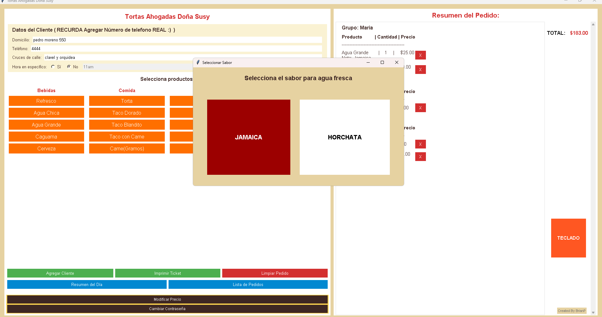

# Tortas Ahogadas Doña Susy - Sistema de Pedidos

## Descripción General

Este programa es un sistema de gestión de pedidos para el negocio "Tortas Ahogadas Doña Susy". Está desarrollado en Python utilizando la biblioteca Tkinter para la interfaz gráfica y SQLite para la gestión de datos de clientes. Permite a los usuarios registrar pedidos de comida y bebidas, gestionar grupos de clientes, imprimir tickets, generar resúmenes diarios y administrar una base de datos de clientes para autocompletar información.
El programa está diseñado para facilitar la toma de pedidos a domicilio, con una interfaz intuitiva que incluye secciones para datos del cliente, selección de productos, resumen del pedido y opciones administrativas como cambiar contraseñas y ver reportes.
Características Principales

Registro de pedidos: Permite agregar productos (tortas, tacos, bebidas, paquetes) al pedido, con opciones para anotaciones (por ejemplo, "sin verdura") y selección de sabores para aguas frescas.
Gestión de grupos: Los pedidos se pueden organizar por grupos de clientes (por ejemplo, "Ana", "General").
Autocompletado de datos del cliente: Utiliza una base de datos SQLite para almacenar información de clientes. Al ingresar un número de teléfono, los campos de domicilio y cruces de calle se autocompletan si el cliente ya está registrado.
Impresión de tickets: Genera e imprime tickets personalizados con los detalles del pedido, incluyendo fecha, domicilio, teléfono, cruces, productos, anotaciones y total.
Resumen del día: Muestra un resumen de todos los pedidos del día con opción de imprimir.
Lista de pedidos: Permite ver e imprimir todos los tickets generados en el día.
Gestión de contraseña: Incluye un sistema básico de contraseña para funciones administrativas como el resumen del día.
Interfaz responsiva: La ventana se adapta a diferentes resoluciones de pantalla, con barras de desplazamiento para manejar contenido extenso.

### Requisitos
Para ejecutar este programa, necesitas lo siguiente:

Python 3.x: Asegúrate de tener Python instalado (versión 3.6 o superior recomendada).
Bibliotecas de Python:
tkinter: Viene preinstalado con Python.
sqlite3: También preinstalado con Python.
pywin32: Necesario para la impresión de tickets en Windows. Instálalo con:pip install pywin32
Sistema operativo: Este programa está diseñado para Windows debido a la dependencia de pywin32 para la impresión. Para otros sistemas, se necesitarían ajustes en la función de impresión.
Impresora configurada: El programa imprime tickets usando la impresora predeterminada del sistema.

Instrucciones de Uso

Instalación:

Descarga o clona el código fuente del programa.
Asegúrate de tener Python y las bibliotecas requeridas instaladas (ver Requisitos).
Coloca el archivo main.py en un directorio de tu elección.

Ejecución:

Abre una terminal en el directorio donde está main.py.
Ejecuta el programa con:python main.py

Se abrirá una ventana gráfica con la interfaz del programa.

Uso del programa:

Datos del cliente:
Ingresa el número de teléfono. Si el cliente ya está registrado, los campos "Domicilio" y "Cruces de calle" se autocompletarán.
Si es un cliente nuevo, llena los campos manualmente. Estos datos se guardarán automáticamente al imprimir el ticket.

Selección de productos:
Usa los botones en las secciones "Bebidas", "Comida" y "Paquetes" para agregar productos al pedido.
Para aguas frescas, se abrirá una ventana para seleccionar el sabor (Jamaica o Horchata).
Puedes agregar anotaciones a los productos (por ejemplo, "sin verdura").

Gestión de grupos:
Usa el botón "Agregar Cliente" para crear un nuevo grupo (por ejemplo, "Ana"). Los productos se asociarán al grupo actual.

Impresión de tickets:
Una vez completado el pedido, presiona "Imprimir Ticket" para generar e imprimir el ticket.

Resumen del día:
Usa el botón "Resumen del Día" para ver todos los pedidos del día. Necesitarás una contraseña (predeterminada: "123").

Lista de pedidos:
Usa el botón "Lista de Pedidos" para ver e imprimir tickets individuales del día.

Cambiar contraseña:
Usa el botón "Cambiar Contraseña" en el pie de página para actualizar la contraseña administrativa.

Base de datos:

El programa crea automáticamente un archivo clientes.db para almacenar datos de clientes.
Los datos se actualizan cada vez que imprimes un ticket.

Estructura del Código

Imports y configuración inicial:
Se importan las bibliotecas necesarias (tkinter, sqlite3, pywin32, etc.).
Se define el diccionario menu_productos con los precios.

Base de datos:
inicializar_base_datos(): Crea la base de datos SQLite y la tabla clientes.
buscar_cliente(): Busca un cliente por teléfono y autocompleta los campos.
guardar_actualizar_cliente(): Guarda o actualiza un cliente en la base de datos.

Funciones principales:
agregar_producto(): Maneja la adición de productos al pedido.
actualizar_ticket(): Actualiza el resumen del pedido en la interfaz.
imprimir_ticket(): Genera e imprime el ticket, y guarda el cliente en la base de datos.
mostrar_resumen_dia(): Genera el resumen diario.
mostrar_lista_pedidos(): Muestra todos los tickets del día.

Interfaz gráfica:
La interfaz se construye con Tkinter, dividida en paneles para datos del cliente, selección de productos, resumen del pedido y opciones administrativas.

### Imágenes del Programa
A continuación, se muestran capturas de pantalla del programa en acción.

Interfaz principal:

Selección de sabor para agua fresca:

Resumen del pedido con grupos:

Resumen del día:

Lista de pedidos:

### Limitaciones:

La impresión está limitada a sistemas Windows debido a la dependencia de pywin32.
La base de datos no incluye una interfaz para eliminar o editar clientes directamente; los datos se actualizan al imprimir tickets.

Desarrollado por: BrianP

Fecha: Mayo de 2025
